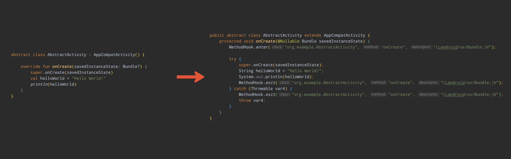

# Android method hook plugin

An Android Gradle plugin to inject method call at the beginning and end of methods in
Android application at compile time using the [ASM](https://asm.ow2.io) library.

Build and tested for AGP version: `8.2.2`.

## Installation

Apply Gradle plugin to Android application

```gradle
plugins {
    id("com.android.application") version <version>
    id("io.github.aleksrychkov.methodhook") version <version>
}
```

## Usage

### Quick start

Create `methodhook_activity.conf` file to instruct plugin what and where to inject calls. You can
place it adjacent to application's build.gradle[.kts] file

```conf
activity {
    type = "default"
    package = "*"
    superClass = "android.app.Activity"
    interfaces = []
    class = "*"
    methods = [ "onCreate" ]
    enter = "org.example.MethodHook.enter"
    exit = "org.example.MethodHook.exit"
}
```

Add plugin's configuration to an Android application's `build.gradle[.kts]` file. In `addConfig`
method specify a path to a created `methodhook_activity.conf` file previously

```gradle
// build.gradle.kts
plugins {
    id("com.android.application") version <version>
    id("io.github.aleksrychkov.methodhook") version <version>
}

android { … }

androidMethodHook {
    configs {
        create("debug") {
            addConfig("./methodhook_activity.conf")
        }
    }
}
```

Create a class with two static methods to be injected by the plugin

```kotlin
package org.example

object MethodHook {
    @JvmStatic
    fun enter(clazz: String, method: String, descriptor: String) {
        println("MethodHook::enter::$clazz.$method.$descriptor")
    }

    @JvmStatic
    fun exit(clazz: String, method: String, descriptor: String) {
        println("MethodHook::exit::$clazz.$method.$descriptor")
    }
}
```

Build project's `debug` buildType.
Now, `onCreate(savedInstanceState: Bundle?)` method of all activities should be
instructed with `MethodHook::enter` and `MethodHook::exit` calls.



### Example

For a practical example of how to configure and use this plugin, refer to
the [examples](./examples).

### Deep dive

#### Config file

A config file specifies which methods in your classes the plugin will modify to inject method calls.
The files are defined in [Typesafe config](https://github.com/typesafehub/config) format.  
You can create as many files as you need, for example, we can create a config file for each Android
app component

```bash
./methodhook_activity.conf
./methodhook_service.conf
./methodhook_broadcast_receiver.conf
./methodhook_content_provider.conf
```

You can define multiple configs inside one file. Start a config with a name

```config
activity {
    ...
}
frgament {
    ...
}
```

#### Config file parameters

* `type`: Specifies type of instrumentation to apply.
    * **Required**
    * Variants:
        * __default__ - instrument methods with `enter` and `exit` static method calls, with following arguments:
          `className: String`, `methodName: String`, `methodDescriptor: String`.
        * __trace__ - instrument methods with `android.os.Trace.beginSection` and `android.os.Trace.endSection` calls.
        * __descriptor__ - instrument methods with `enter` and `exit` static method calls. `enter` method must have same
          list of arguments as instrumented method, `exit` must have single nullable argument of `android.lang.Object`(
          `kotlin.Any`) type.

* `package`: Specifies the package name that identifies the group of classes where the plugin will target methods for
  injection.
    * **Required**
    * Variants:
        * /* - any package.
        * __package__, e.g. `"org.example"`


* `superClass`: Specifies the parent class (__canonical name__) for which the plugin should target methods in its
  subclasses.
    * **Required**
    * Variants:
        * \* - any parent class or none.
        * __canonical name__, e.g. `"android.app.Activity"`.

* `interfaces`: Specifies a list of interfaces (by __canonical name__). If a class implements any of the specified
  interfaces, its methods will be instrumented.
    * **Required**
    * Variants:
        * \* - any interface or none.
        * __canonical name__, e.g. `[ "java.util.RandomAccess" ]`.

* `class`: Specifies the exact class (__canonical name__) for which the plugin should target methods.
    * **Required**
    * Variants:
        * \* - any class.
        * __canonical name__, e.g. `"org.example.SomeClass" `.

* `methods`: Specifies an array of methods (identified by their names) where the plugin will inject additional code.
    * **Required**
    * Variants:
        * \* - all methods including constructor.
        * __method name__ - exact method name to be instrumented, e.g. ` [ "onCreate" ]`.

* `descriptor`: Specifies instrumented method descriptor.
    * **Not required**
    * Variants:
        * __method descriptor__, e.g. `"(Landroid/content/Context;)V"`.

* `enter`: Specifies a reference to a method to be injected at the beginning of instructed methods.
    * **Not required**
    * Variants:
        * __static method reference__, e.g. `org.example.MethodHook.enter`
* `exit`: Specifies a reference to a method to be injected at the end of instructed methods.
    * **Not required**
    * Variants:
        * __static method reference__, e.g. `org.example.MethodHook.exit`

#### Plugin configuration

In order to apply plugin to application, add `androidMethodHook` configuration to the
application's `build.gradle[.kts]`
file

```gradle
// build.gradle.kts
plugins {
    id("com.android.application") version <version>
    id("io.github.aleksrychkov.methodhook") version <version>
}

android {
    buildTypes {
        debug { … } 
        release { … }        
    }
}

androidMethodHook {
    forceLogging = true       
    configs {
        create("debug") {
            addConfig("./methodhook_activity_debug.conf")
        }
        create("release") {
            addConfig("./methodhook_activity_release.conf")
        }
    }
}
```

The `androidMethodHook` configuration supports next options:

* `forceLogging`: Enables info logs of the plugin. Same as if executing gradle command with `--info` flag, e.g.
  `./gradlew assembleDebug --info`. Default value is `false`.

* `configs`: Creates plugin's config for specific build variant. The name of config must be the same as name of build
  variant, e.g. buildType: `debug`, or if you have productFlavor named `demo`: `demoDebug`. You can have separate sets
  of config for different build variants.
    * `addConfig`: Adds relative path to a config file.

## References

* [Using the ASM framework to implement common Java bytecode transformation patterns](https://lsieun.github.io/assets/pdf/asm-transformations.pdf)
* [ASM framework - Eugene Kuleshov](https://wiki.jvmlangsummit.com/pdf/23_Kuleshov_asm.pdf)
* [ASM guide](https://asm.ow2.io/asm4-guide.pdf)

## License

    Copyright Aleksandr Rychkov

    Licensed under the Apache License, Version 2.0 (the "License");
    you may not use this file except in compliance with the License.
    You may obtain a copy of the License at

       http://www.apache.org/licenses/LICENSE-2.0

    Unless required by applicable law or agreed to in writing, software
    distributed under the License is distributed on an "AS IS" BASIS,
    WITHOUT WARRANTIES OR CONDITIONS OF ANY KIND, either express or implied.
    See the License for the specific language governing permissions and
    limitations under the License.